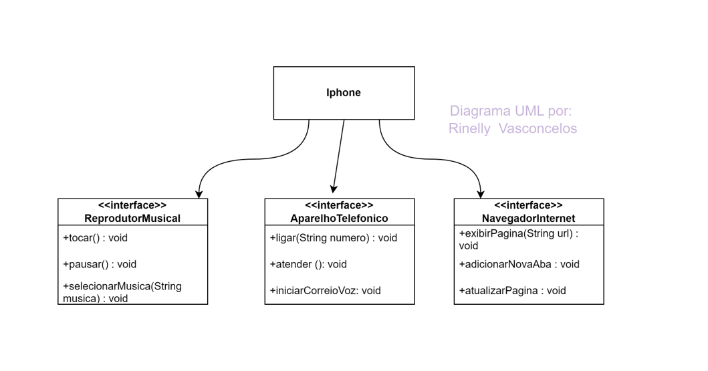

<h1> ▪️ DESAFIO DO IPHONE 📱</h1>

<h2> ▪️ Modelando o iPhone com UML: Funções de Músicas, Chamadas e Internet. </h2>

 O desafio proposto consiste em elaborar a diagramação das classes 
e interfaces, representando as funções do iPhone como Reprodutor Musical, Aparelho Telefônico e Navegador na Internet. 
Após isso, criar as classes e interfaces no formato de arquivos .java.  

Abaixo temos a imagem do diagrama que eu desenvolvi utilizando a ferramenta Draw.io.

<h3>▪️ Diagrama UML</h3>

 

<h4>&#128241; Conecte-se comigo:</h4>

  
 "Você não pode mudar o vento, mas pode ajustar as velas do barco para chegar onde quer." - Confúcio
